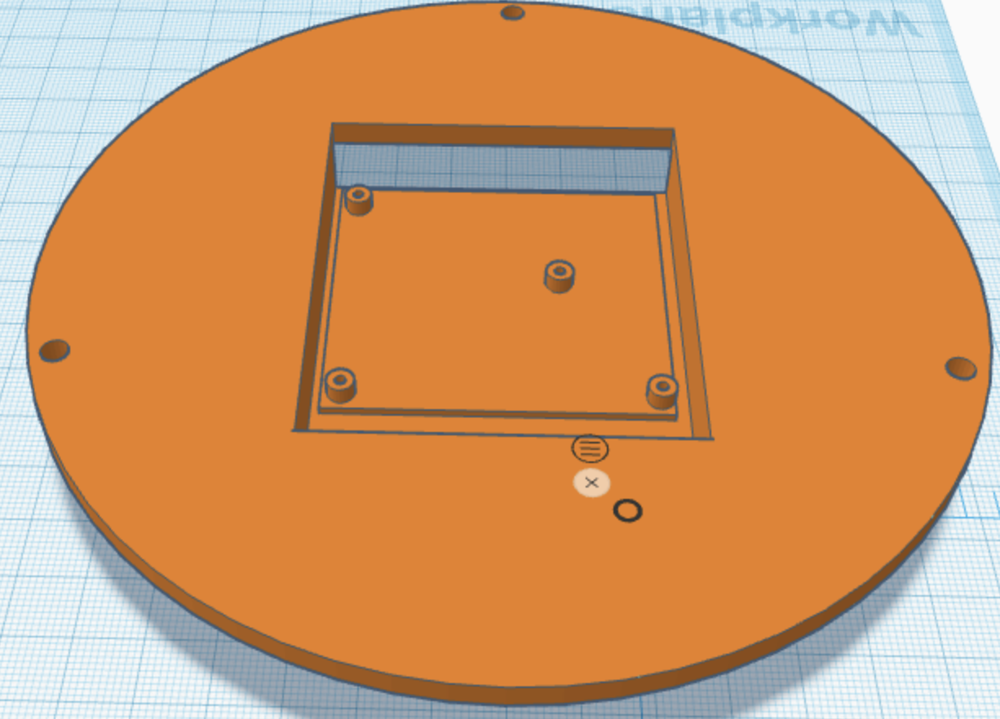

## 5" Round Retro-Sci-Fi HDMI Display

This repo is a reference for building your own adjustable-arm retro-Sci-Fi display.

The materials I used in this project were:
- [Wisecoco 5" display with HDMI board](https://www.aliexpress.com/item/3256801507842352.html?spm=a2g0o.order_list.0.0.6e311802opfGCY&gatewayAdapt=4itemAdapt)
*Note:* you can buy the display and HDMI board separately, but the holes in the STL are for this one

- [Obudyard Goosneck Desk Mount Arm](https://www.amazon.com/gp/product/B09V14Q92X)

- 3 M4x20 screws and nuts

- 4 2mm screws for attaching the HDMI board

- Mini-HDMI to HDMI cable

- USB-A-to-Micro-B cable for power

- twist-tie

## Assembly
Print the three STL files with high resolution (or you'll have to drill the screw holes out, likely).

The display goes between the bezel and the mid-case section. There's a notch in the bezel for the folded-over ribbon cable.

This is the top of the display (the logical top of the image to be displayed).

There's a matching notch in the mid-case section:

The hole pattern for the back of the display is designed to mount the HDMI board "upside down,"
such that the board-mounted components face the _rear_ of the display, and the Mini-HDMI are accessible from the opening:

Attach the HDMI board to the case back.

The display cable connects by MIPI connector to the HDMI board.
The cables have pin one marked, so be careful to orient them correctly.
The design should allow a mild bend in the cable.

The holes are NOT symmetric, so take care to orient the components so that all of the screw holes align.

Screw the M4x20 screws through the bezel and into the mid-case, making sure not to catch the LCD with the screws.

Attach the back to the mid-case by tightening the M4 screws through the back.
Tighten the M4 nuts on the back of the display.

Without unlocking the Obudyard Arm's mounting "claw," expand the spring-loaded clips on either side
just enough to allow the rear mounting bracket to slide into the mount.

Clip the HDMI cable onto the arm, and use a twist-tie to tie up the USB cable:

## Use

The display is 1080x1080 round - which means it's mapped as a square display, but with the square edges "cut off."

If you overdrive the display with the wrong resolution or refresh rate, it may "hang," requiring a power-cycle.

I've tried the display with several systems. It only seems to have problems with my MacBook Pro, but I haven't been able to troubleshoot.
